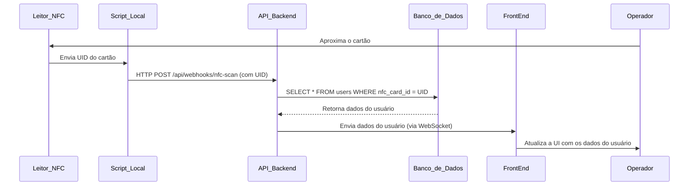

# Specs: Módulo de Controle de Acesso por NFC
**Projeto:** Sistema de Controle de Estoque
**Feature:** Integração com Leitor NFC para Identificação de Usuário
**Versão:** 1.0
**Data:** 27 de setembro de 2025

## 1. Visão Geral

O objetivo deste módulo é permitir que um operador de estoque identifique um usuário de forma rápida e segura através da leitura de um cartão NFC. Ao aproximar o cartão do leitor, o sistema deve buscar as informações do usuário correspondente e exibi-las instantaneamente na interface web (front-end), agilizando o processo de registro de operações de estoque.

### User Story Principal
> "Como um operador de estoque, eu quero escanear o cartão NFC de um colaborador para que seus dados apareçam imediatamente na tela, permitindo que eu associe a ele uma entrada ou saída de material sem precisar procurá-lo manualmente no sistema."

## 2. Atores

- **Operador de Estoque:** O usuário humano que interage com a aplicação front-end e com o leitor NFC.
- **Estação do Leitor NFC:** Um computador dedicado (PC ou Raspberry Pi) conectado fisicamente ao leitor NFC. Executa um script local para capturar o ID do cartão.
- **API Backend:** A aplicação servidora existente que contém a lógica de negócio, acesso ao banco de dados e a comunicação em tempo real.
- **Aplicação Front-end:** A interface web (executada no navegador) utilizada pelo Operador de Estoque.

## 3. Arquitetura do Fluxo

O fluxo de dados ocorre em tempo real, seguindo as etapas abaixo:

1.  O **Leitor NFC** lê o UID (Identificador Único) de um cartão.
2.  O **Script Local** na Estação captura este UID.
3.  O Script Local envia o UID para a **API Backend** através de uma requisição `HTTP POST` para um endpoint de webhook.
4.  A **API Backend** recebe o UID, consulta o banco de dados para encontrar o usuário associado.
5.  Após encontrar o usuário, a **API Backend** envia os dados do usuário para o **Front-end** através de uma conexão **WebSocket** ativa.
6.  O **Front-end** recebe os dados via WebSocket e atualiza a interface do usuário dinamicamente para exibir as informações.

### Diagrama do Fluxo

## 4. Requisitos Funcionais

4.1. API Backend (Componente Servidor)

    [TASK-BE-01] Criar Endpoint de Webhook para Leitura NFC:

        Rota: POST /api/webhooks/nfc-scan

        Corpo da Requisição (Request Body): Deve aceitar um JSON com o ID do cartão.
        JSON

        {
          "cardId": "string"
        }

        Segurança: O endpoint deve ser protegido por uma chave de API (API-Key) enviada no cabeçalho (Header) da requisição. Requisições sem a chave ou com chave inválida devem retornar 401 Unauthorized.

        Retorno Sucesso: 200 OK com uma mensagem simples.

        Retorno Erro (Cartão não encontrado): 404 Not Found.

    [TASK-BE-02] Implementar Lógica de Negócio do Webhook:

        O handler do endpoint deve validar o cardId recebido.

        Deve consultar o repositório de usuários (banco de dados) para encontrar um registro com o cardId correspondente.

    [TASK-BE-03] Implementar Comunicação WebSocket:

        O servidor deve ter um endpoint WebSocket para o front-end se conectar.

        Após o processamento do webhook, o servidor deve publicar uma mensagem em um tópico específico (ex: /topic/scan-events).

        Payload de Sucesso: Enviar um objeto JSON com os dados do usuário encontrado.

        Payload de Falha: Enviar um objeto JSON indicando que o cartão não foi encontrado.

4.2. Aplicação Front-end (Componente Cliente)

    [TASK-FE-01] Estabelecer Conexão WebSocket:

        Ao carregar a página de controle de estoque, a aplicação deve iniciar e manter uma conexão WebSocket com a API Backend.

        A aplicação deve ser capaz de se reconectar automaticamente em caso de queda de conexão.

    [TASK-FE-02] Ouvir Eventos do WebSocket:

        A aplicação deve se inscrever no tópico /topic/scan-events.

        Deve existir um handler para processar as mensagens recebidas neste tópico.

    [TASK-FE-03] Gerenciar Estado da Interface:

        Estado Inicial: A UI deve exibir uma mensagem como "Aguardando leitura do cartão...".

        Estado de Sucesso: Ao receber os dados de um usuário válido, a UI deve ser atualizada para exibir as informações (ex: nome, foto, matrícula).

        Estado de Erro: Ao receber uma mensagem de erro (cartão não encontrado), a UI deve exibir uma notificação clara e temporária (ex: "Cartão não reconhecido") e retornar ao estado inicial.

4.3. Script da Estação Local (Leitor NFC)

    [TASK-LOCAL-01] Configurar Leitura do Hardware:

        O script deve ser capaz de se conectar à porta (USB/Serial) onde o leitor NFC está operando.

        Deve ler continuamente os dados de entrada para capturar o UID do cartão. Muitos leitores emulam um teclado; o script deve ser robusto para lidar com isso.

    [TASK-LOCAL-02] Implementar Requisição HTTP para o Webhook:

        Após capturar um UID, o script deve montar e enviar uma requisição HTTP POST para o endpoint da API.

        A requisição deve incluir o cabeçalho API-Key com o token secreto.

        O corpo da requisição deve ser um JSON no formato {"cardId": "UID_CAPTURADO"}.

    [TASK-LOCAL-03] Implementar Tratamento de Erros e Logging:

        O script deve logar todas as tentativas de envio (sucesso e falha) em um arquivo local ou no console.

        Em caso de falha de rede (ex: impossível conectar à API), o script deve registrar o erro e, opcionalmente, tentar reenviar a requisição algumas vezes.

5. Requisitos Não-Funcionais

    Segurança: A comunicação entre o script local e a API deve usar HTTPS. A chave de API não deve ser exposta no código-fonte do front-end.

    Desempenho: O tempo total desde a aproximação do cartão até a atualização da interface no front-end não deve exceder 2 segundos em condições normais de rede.

    Confiabilidade: O sistema deve ser resiliente a falhas de conexão. O script local não deve travar se a API estiver offline, e o front-end não deve quebrar se a conexão WebSocket for perdida.

6. Estruturas de Dados (Payloads)

    Requisição Webhook (Script -> Backend):
    JSON

{
  "cardId": "04A6C33A5E6F80"
}

Mensagem WebSocket (Backend -> Frontend) - Sucesso:
JSON

{
  "status": "SUCCESS",
  "data": {
    "userId": 123,
    "name": "João da Silva",
    "role": "Almoxarife",
    "imageUrl": "[https://example.com/path/to/image.jpg](https://example.com/path/to/image.jpg)"
  }
}

Mensagem WebSocket (Backend -> Frontend) - Falha:
JSON

    {
      "status": "ERROR",
      "message": "Usuário não encontrado para o cartão fornecido."
    }

7. Critérios de Aceite

    [ ] Cenário 1 (Sucesso): Quando um cartão válido é escaneado, as informações do usuário correspondente são exibidas na tela do front-end em menos de 2 segundos.

    [ ] Cenário 2 (Cartão Inválido): Quando um cartão não cadastrado no sistema é escaneado, o front-end exibe uma mensagem de erro clara ("Cartão não reconhecido") por alguns segundos e depois volta ao estado de espera.

    [ ] Cenário 3 (API Offline): Se o script local não conseguir se conectar à API, ele deve registrar um erro no console/log e continuar tentando ler o próximo cartão.

    [ ] Cenário 4 (Segurança): Uma requisição ao webhook sem a API-Key correta no cabeçalho deve ser rejeitada com um status 401 Unauthorized.